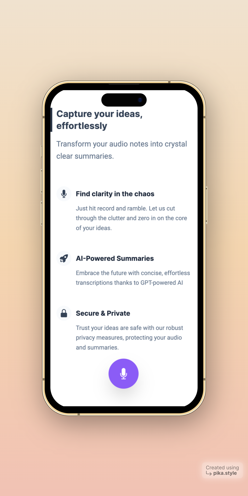

# Mic.AI - Audio Summarizer

Mic.AI is an intuitive audio-to-summary tool designed to help you effortlessly capture audio notes and process them into clear, concise summaries. Ideal for brainstorming sessions, meetings, lectures, and more, Mic.AI harnesses the power of AI to streamline your thought process and enable better decision-making.



## Features

- **Intuitive Audio Recording**: Capture your audio notes with ease and efficiency.
- **AI-Powered Summarizations**: Transform your audio into digestible summaries in just a few clicks.
- **Clarity and Focus**: Extract key insights and core ideas from your audio to enhance productivity.
- **Versatile Use-Cases**: Perfect for students, professionals, and creatives to summarize lectures, meetings, or quick idea jots.
- **Secure and Private**: Robust privacy measures ensure your ideas and data are protected.
- **Easy Accessibility & Sharing**: Access your audio notes and summaries from any device and share them with others.

## Getting Started

Follow these steps to set up and run the Mic.AI application locally.

### Prerequisites

- Node.js (version 12.x or higher recommended)
- Yarn or npm (package manager)

### Installation

1. Clone the repo

   ```
   git clone https://github.com/yazinsai/mic-ai
   ```

2. Navigate to the project directory

   ```
   cd mic-ai
   ```

3. Install dependencies

   ```
   yarn install
   ```

   or

   ```
   npm install
   ```

4. Run the development server

   ```
   yarn dev
   ```

   or

   ```
   npm run dev
   ```

5. Open your browser and navigate to `http://localhost:3000`. The app should now be running locally.

## Usage

To start using Mic.AI, simply click the recording button to capture your audio notes. Once the recording is complete, Mic.AI will automatically process the audio and generate a concise summary. You can then review, edit, and share your summary as needed.

## Contributing

Contributions are welcome and greatly appreciated! To get involved, please follow these steps:

1. Fork the repository.
2. Create a new branch (`git checkout -b feature/my-feature`).
3. Make your changes and commit them (`git commit -m 'Add my feature'`).
4. Push the branch to your fork (`git push origin feature/my-feature`).
5. Create a new pull request.

## License

Distributed under the MIT License. See `LICENSE` for more information.

## Contact

[Yazin] - hi@yazin.ai

Project Link: https://github.com/yazinsai/mic-ai
